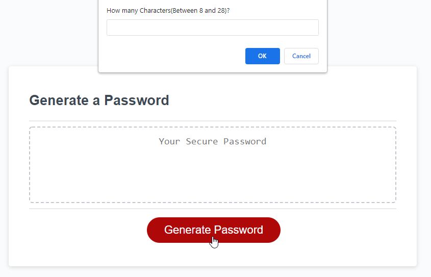

# Password-Generator#

## Description
This is a password generator. It will generate a randomized password for the given criteria by the user. The length varies from 8-128 characters. Based on user's choice it can include lowercase, uppercase, numbers, and symbols. 

## Installation
https://christopherponzio.github.io/Password-Generator/
https://github.com/ChristopherPonzio/Password-Generator/settings/pages

## Usage
By Answering a few questions from a windows alert the password will be generated automatically once the Generate Password button is toggled.

## Credits
1. Michelle Blackwell github: https://github/Mblackwellgca
2. https://stackoverflow.com
3. https://w3schools.com

## License
No License